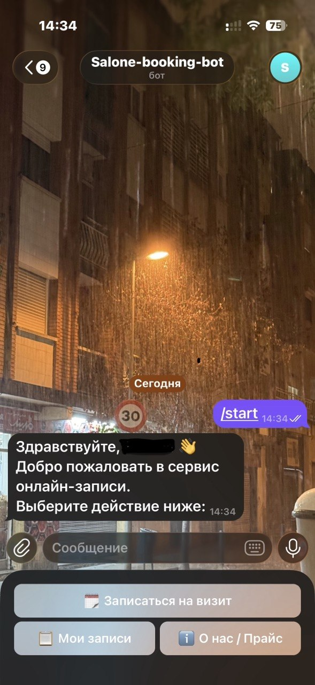
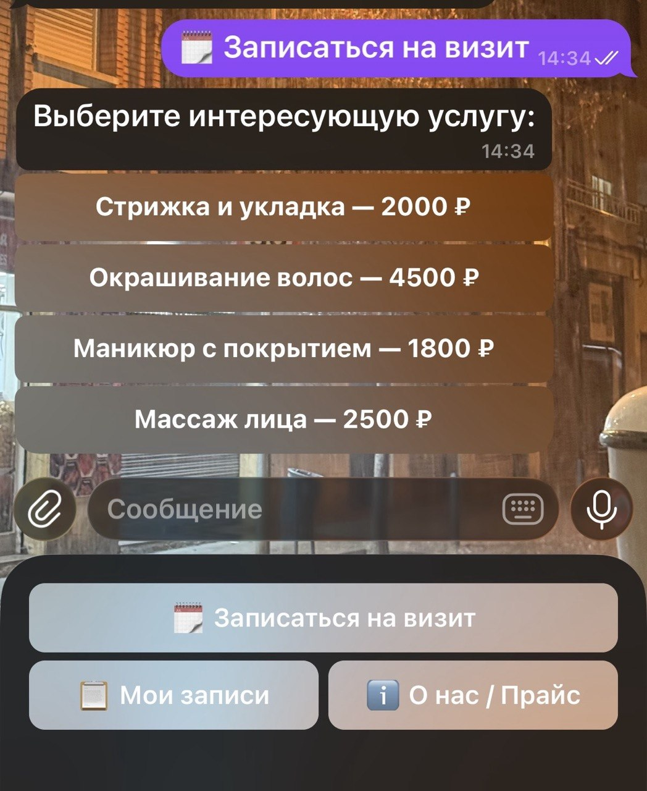
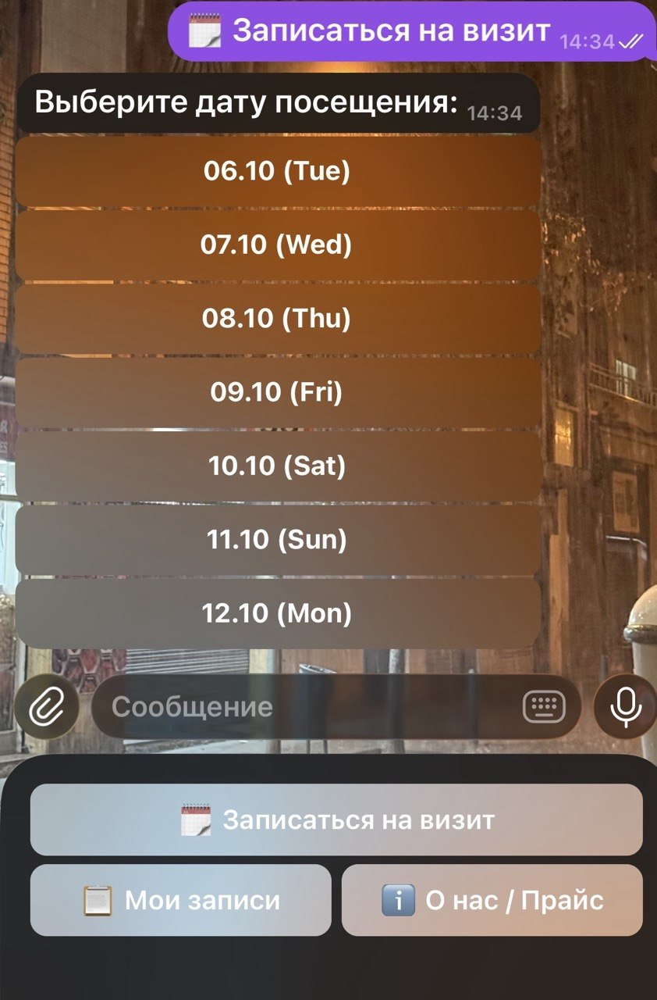
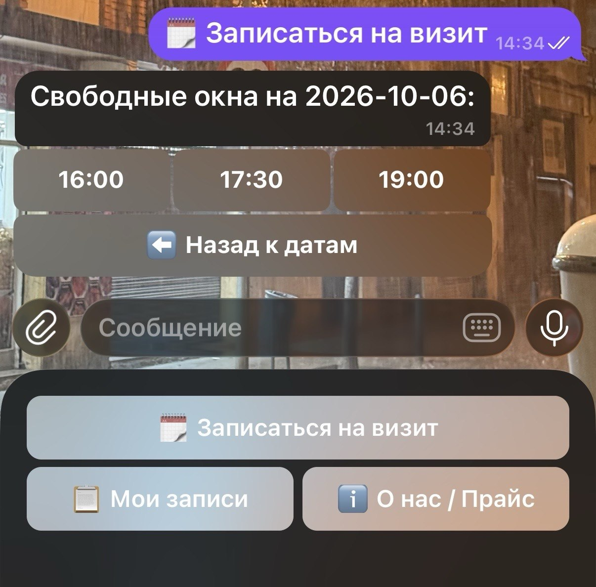
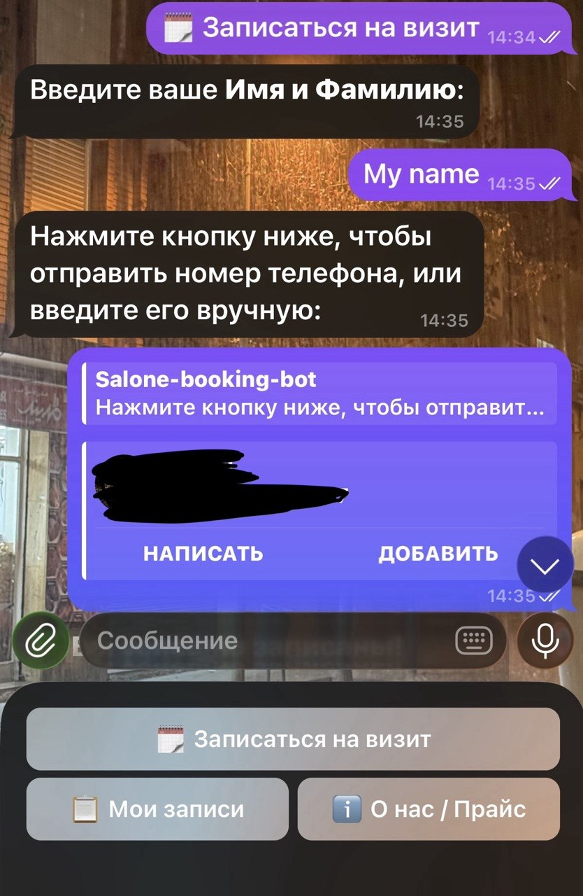

# 💇 telegram-booking-bot

Telegram-бот для онлайн-записи клиентов в салон красоты, барбершоп или к частному мастеру. Клиент сам выбирает услугу, дату и время, а администратор получает уведомления и управляет расписанием прямо в Telegram.

## Скриншоты

| Главное меню | Выбор услуги | Выбор даты |
|:---:|:---:|:---:|
|  |  |  |

| Свободное время | Ввод данных |
|:---:|:---:|
|  |  |

## Возможности

**Для клиента**
- Запись по шагам: услуга → дата → время → имя → телефон

- Показываются только свободные окна на ближайшие 7 дней

- На сегодня скрываются уже прошедшие часы

- Телефон можно отправить кнопкой или ввести вручную

- Просмотр своих актуальных записей

- Раздел с прайсом и информацией о салоне

- Автоматическое напоминание за день до визита


**Для администратора** (команда `/admin`)
- Мгновенное уведомление о каждой новой записи

- Расписание на сегодня

- Все предстоящие записи

- Отмена записи по номеру, клиент получает сообщение об отмене

- Доступ только по списку Telegram ID


**Защита от ошибок**
- Повторная проверка слота перед подтверждением, чтобы два клиента не записались на одно время


## Технологии

- Python 3

- aiogram 3: работа с Telegram API и машина состояний (FSM)

- SQLite + aiosqlite: хранение записей

- APScheduler: напоминания по расписанию


## Как запустить

1. Установите зависимости:

```
   pip install -r requirements.txt
```
2. Создайте бота у @BotFather и получите токен.
3. В файле `bot.py` впишите токен в `BOT_TOKEN` и свой Telegram ID (число) в `ADMIN_IDS`.
4. При желании измените список услуг `SERVICES` и рабочие часы `WORK_HOURS`.
5. Запустите:
```
   python bot.py
```

База данных `salon_booking.db` создаётся автоматически при первом запуске.

## Планы по развитию

- Учёт длительности услуги при выборе времени

- Отмена и перенос записи самим клиентом

- Выбор мастера

- Настройка часового пояса под салон


## Заказать такого бота

Нужен похожий бот под ваш бизнес? Напишите: kwork.com https://kwork.com/user/fontill или Telegram @Fontill
